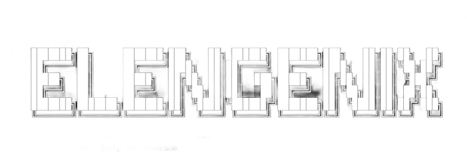

<div align="center">

# ELENGENIX

### Autonomous AI Agent Framework for Security Research

[](https://python.org)
[](https://golang.org)
[](LICENSE)
[](https://github.com/Ashveil1/Elengenix/actions/workflows/test.yml)

</div>

<p align="center">
  
</p>

> [!IMPORTANT]
> **LEGAL & SECURITY DISCLAIMER:** This framework is designed strictly for educational purposes, authorized security research, and defensive penetration testing. The authors are not responsible for any misuse, unauthorized targeting, or damage caused by the autonomous execution capabilities of this tool. Users are solely responsible for ensuring full legal authorization before initiating any scans or test sequences.

---

## What is Elengenix?

Elengenix is an open-source framework that turns security research into a reasoning problem. Rather than scripting fixed attack sequences, it deploys an AI agent that reads a target, builds an attack tree, selects tools, interprets findings, and adapts its strategy in real-time — the same way a skilled penetration tester thinks.

It is designed to be **provider-agnostic**, **mobile-deployable** (Termux), and **safe by design**: every command passes through a governance engine that blocks destructive operations without limiting research flexibility.

---

## Why It Exists

The current state of security tooling has a fundamental gap: tools are powerful, but brittle. They require deep expertise to chain together, produce unfiltered noise, and cannot reason about what a finding actually means in the context of a target's architecture.

Elengenix exists to close this gap — to give researchers a collaborator that understands both the technical and business dimensions of a vulnerability, can estimate its exploitability and payout value, and documents the full chain of evidence automatically.

---

## Core Design Principles

- **Reasoning over rules** — The agent dynamically constructs its attack plan from a live understanding of the target, not a predefined checklist.
- **Multi-model collaboration** — Up to 3 AI models work as a team (Strategist, Recon Lead, Exploit Analyst), cross-validating findings and sharing context.
- **Safety without friction** — A governance layer classifies every action as SAFE, PRIVILEGED, or DESTRUCTIVE. Dangerous commands are blocked; sensitive ones require user confirmation; safe ones execute immediately.
- **Memory across sessions** — Findings, decisions, and context persist across sessions via semantic vector memory (ChromaDB / SQLite FTS5 fallback).

---

## Quick Start

**Prerequisites:** Python 3.10+, Go 1.20+

```bash
git clone https://github.com/Ashveil1/Elengenix.git && cd Elengenix

# Install dependencies (Python + Go security tools)
chmod +x setup.sh && ./setup.sh

# Verify environment
elengenix doctor

# Configure AI providers
elengenix configure
```

*Supports Android via Termux: `chmod +x termux_setup.sh && ./termux_setup.sh`*

---

## Usage

### Terminal UI
```bash
elengenix tui
```

Two operational modes:
- **CHILL** — Safe research, chat, code review. Tool execution disabled.
- **HUNT** — Full autonomous vulnerability hunting.

| Key | Action |
|-----|--------|
| `Ctrl+M` | Toggle CHILL / HUNT |
| `Ctrl+S` | Settings overlay |
| `Ctrl+G` | Help |

### Slash Commands
```
/target <domain>        Set target scope
/mode <chill|hunt>      Switch mode
/talk <1|2|3|all>       Route to specific agent in the team
/session <new|list|load> Manage sessions
/stats                  Memory & scan statistics
```

### CLI Commands
```bash
elengenix scan <target>       # Full automated scan pipeline
elengenix autonomous <target> # Fully autonomous mode
elengenix sast <path>         # Static code analysis
elengenix research <cve>      # CVE / exploit research
elengenix watchman            # 24/7 monitoring daemon
elengenix scan <target> -q    # Quiet mode: suppress phase-by-phase output
```

### Phase 0: Elengenix Framework Pre-flight

Every `elengenix scan` invocation starts with **Phase 0: Pre-flight**, which runs
5 pure-Python modules + a PythonRecon fallback to produce baseline findings
**without requiring any third-party tool or AI provider**. This guarantees
actionable output even when the network is rate-limited, AI quota is exhausted,
or no scanners are installed.

| Phase | Module | What it does |
|:-----:|--------|--------------|
| 1 | `PythonRecon` | HTTP probe, directory discovery, port scan, subdomain enumeration, parameter discovery (interest-based delta) |
| 2 | `SmartWAFDetector` | Probe-based WAF detection + suggested evasions (Cloudflare, Akamai, ModSecurity, etc.) |
| 3 | `ActiveFuzzer` | XSS / SQLi / SSTI payload testing on top-3 discovered parameters |
| 4 | `BOLATester` | Differential IDOR testing on endpoints with user/account/profile path tokens |
| 5 | `LearningEngine` | Records every finding to a per-target SQLite database |
| 6 | `CoverageAnalyzer` | Tracks endpoint coverage and untested paths |

The preflight findings are passed to the AI agent (if available) as context and
saved to `reports/<target>_<timestamp>/elengenix_findings.json`.

### elengenix_findings.json format

```json
[
  {
    "tool": "python_recon",
    "type": "param_discovery",
    "severity": "Low",
    "url": "https://target.com/api/users",
    "title": "Interesting parameter: q (GET)",
    "details": "Delta: 42% (baseline=1200, test=1700)"
  }
]
```

Fields: `tool`, `type` (recon_http|endpoint|port|subdomain|param_discovery|waf|xss|sqli|bola),
`severity` (Critical|High|Medium|Low|Informational), `url`, `title`, `details`.

### When AI is unavailable

If the configured AI provider (Gemini, OpenAI, NVIDIA NIM, etc.) returns errors
— usually due to quota exhaustion, invalid API key, or network issues — Elengenix
**does not produce an empty report**. Instead it auto-generates a report from
preflight findings:

- **Severity breakdown** — count by Critical/High/Medium/Low/Informational
- **Type breakdown** — count by finding type
- **High-priority targets** — top 10 Critical/High findings with URLs
- **Recommended next steps** — numbered list of follow-up actions
- **AI provider fix instructions** — link to https://aistudio.google.com/apikey

A prominent yellow banner is printed when AI is unavailable. Fix AI access:
1. Check API keys in `.env` (GEMINI_API_KEY, OPENAI_API_KEY, etc.)
2. Verify provider quota at https://aistudio.google.com/apikey
3. Or reconfigure with `python3 main.py configure`

---

## Architecture

```
User Input ──► Governance Gate ──► AI Reasoning Engine
                                          │
                     ┌────────────────────┼────────────────────┐
                     ▼                    ▼                    ▼
               Attack Planner      Tool Registry         Analysis Pipeline
               (Dynamic tree)      (90+ tools)           (BOLA, CVSS, WAF,
                                                          SOC, Exploit Chain)
                                          │
                                   Vector Memory
                                   (Cross-session recall)
```

---

## AI Providers Supported

OpenAI · Anthropic · Google Gemini · Groq · NVIDIA NIM · Mistral · DeepSeek · Perplexity · OpenRouter · Ollama (local)

---

## Testing

```bash
python3 -m pytest tests/ -v
```

Test coverage includes: governance enforcement, native shell execution policy, target validation, multi-agent coordination, and session management.

---

## Project Structure

```
main.py              # CLI router
agent_brain.py       # Core AI reasoning engine
cli_textual.py       # Terminal UI (Textual)
tools/
  governance.py      # Risk classification engine
  multi_agent.py     # Team Aegis collaboration (up to 3 models)
  analysis_pipeline.py  # Post-finding analysis (CVSS, BOLA, chains)
  vector_memory.py   # Semantic memory (ChromaDB / SQLite FTS5)
  safe_exec.py       # Governance-gated native shell execution
tests/               # pytest test suite
knowledge/           # Security methodology documentation
```

---

## Contributing

See [CONTRIBUTING.md](CONTRIBUTING.md) for code standards, logging conventions, and security rules.

**Core rules:** 4-space indent · type hints everywhere · raw shell only behind governance · API keys in `.env` only

---

## License

- **License**: GPL-3.0 — see [LICENSE](LICENSE) for details.

---

## ⚡ Compute Sponsorship & API Integration

We are incredibly grateful to the **AMD AI Cloud** program for sponsoring the high-performance compute infrastructure powered by **AMD Instinct™ MI300X** accelerators.

Rather than competing with general-purpose frontier models, Elengenix is built on a **hybrid-intelligence model**:
- **Downstream Utility Specialization** — We leverage local AMD accelerators to pre-process large security data sets, run high-frequency log parsing, and train specialized, lightweight helper models (e.g., 7B/8B parameter models) for specific local formatting and regex extraction tasks.
- **Frontier API Orchestration** — The main strategic planners, multi-agent consensus logic, and high-level reasoning systems are designed to consume frontier APIs like Claude and GPT. These models act as the master orchestrators that direct our local utilities.

---

<div align="center">

*Built by independent security researchers, for the open-source security community.*

</div>
